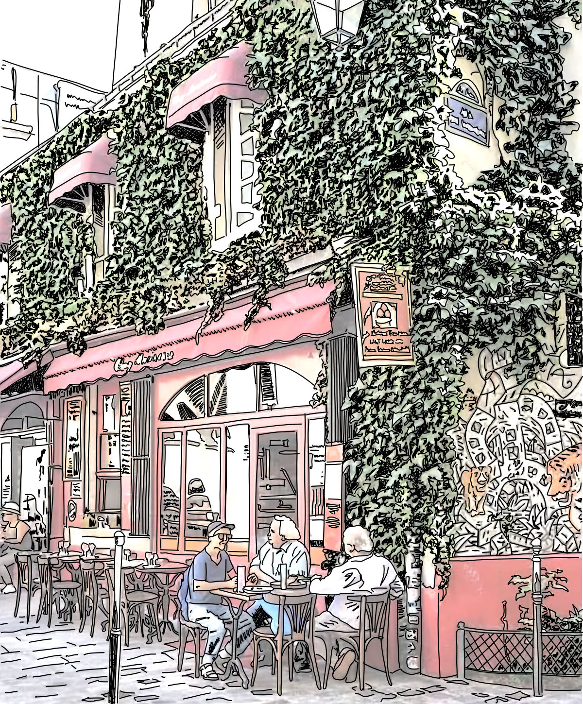

>"There is no first moment, no single word or place from which this or any other story begins…
>
>…It must be arbitrary, then the place at which we choose to embark.
>
>This place for instance.”

This passage begins Weaveworld, by Clive Barker. I read this book many years ago as a young twenty-something. I have always loved this beginning. This embarkation. For some reason I have always remembered these words. I don’t know why I can recall this passage over so many other countless passages I have absorbed in the years since first I read Barker’s story. They have always been with me, words of fiction actualized in some small measure in the world through my own experiences. The words resonate. They have been my constant companions, silent and sleeping in the the small secret places of my being.

These were words I had spoken at some long forgotten and unrememebred moment. Words uttered in a past life and pulled from the collective ether and penned by another.

There is no beginning. No point of departure. No destination. No place at which we arrive. Life is an endless series of moments that neither begin or end. Present and immediate.

This place for instance.

